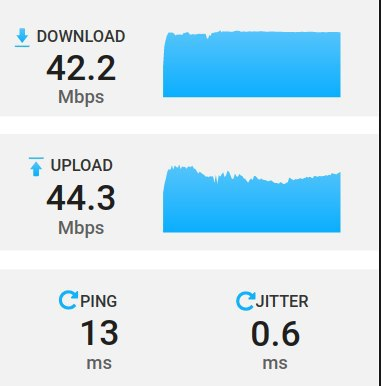
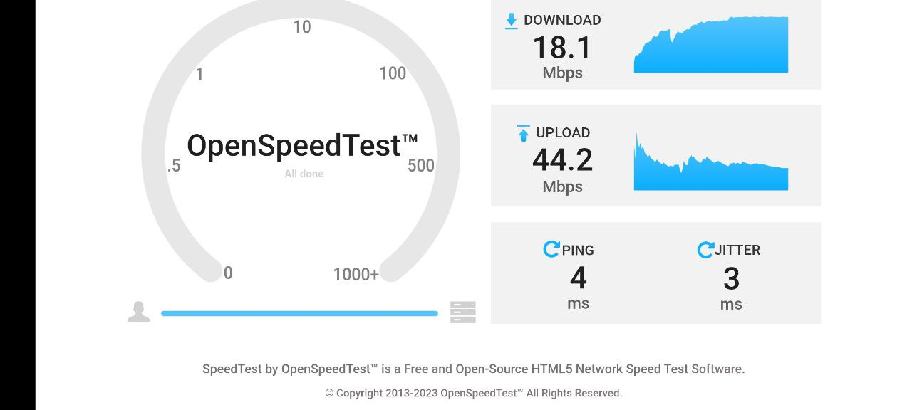
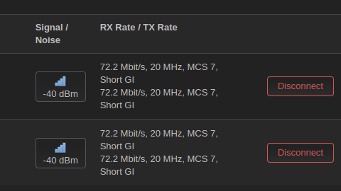

# Speed tests using the USB wireless network adapter

## Single client test

- The download speed flatlined at 42.2 Mbps.
- The upload speed was 44.3 Mbps with small changes.
- The ping was 13 ms and the jitter was 0.6 ms.

- RX: 72.2 Mbit/s, 20 MHz, MCS 7, Short GI
- TX: 72.2 Mbit/s, 20 MHz, MCS 7, Short GI
- Signal: -41 dBm

## Multiple client test

### Laptop

### Phone

### OpenWrt

